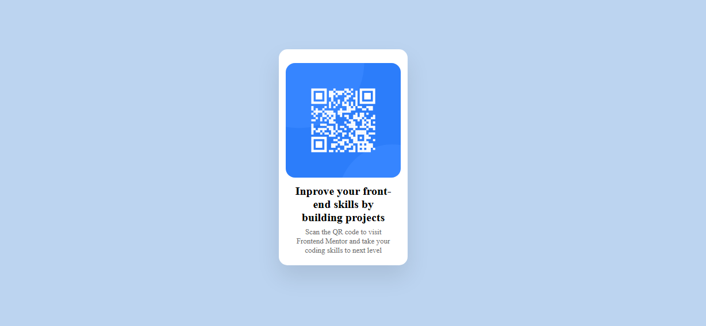

# Frontend Mentor - QR code component
This is a solution to the [QR code component challenge on Frontend Mentor](https://www.frontendmentor.io/challenges/qr-code-component-iux_sIO_H). Frontend Mentor challenges help you improve your coding skills by building realistic projects.

## Table of contents

- [Overview](#overview)
  - [Screenshot](#screenshot)
  - [Links](#links)
- [My process](#my-process)
  - [Built with](#built-with)
  - [What I learned](#what-i-learned)
  - [Continued development](#continued-development)
- [Author](#author)

## Overview

### Screenshot



### Links

- Solution URL [Here](https://github.com/LionsBrott/qr-code)
- Live Site URL [Here](https://lionsbrott.github.io/qr-code/)

## My process

### Built with

- Semantic HTML5 markup
- CSS custom properties
- Flexbox
- Responsive design
- Mobile-first workflow

### What I learned

During this project, I practiced important CSS concepts, especially:

**Flexbox for centering:**
```css
.conteiner {
    display: flex;
    margin: 0 auto;
    height: 100dvh;
    width: min-content;
}

.card {
    margin: auto auto;
}
```

**Responsive units:**
```css
.image {
    width: 80dvw;
    height: 80dvh;
    max-width: 200px;
    max-height: 200px;
}
```

**Box-shadow for depth:**
```css
.card {
    box-shadow: 0 20px 40px rgba(0, 0, 0, 0.1);
}
```

This project helped me better understand how to use Flexbox for centering and how to work with responsive units (dvw, dvh) to create layouts that work well on different screen sizes.

### Continued development

In future projects, I want to focus on:

- Improving my understanding of CSS Grid
- Learning more about web accessibility
- Practicing CSS animations
- Exploring CSS frameworks like Tailwind

## Author

- GitHub - [LionsBrott](https://github.com/LionsBrott)
- Frontend Mentor - [@LionsBrott](https://www.frontendmentor.io/profile/LionsBrott)
